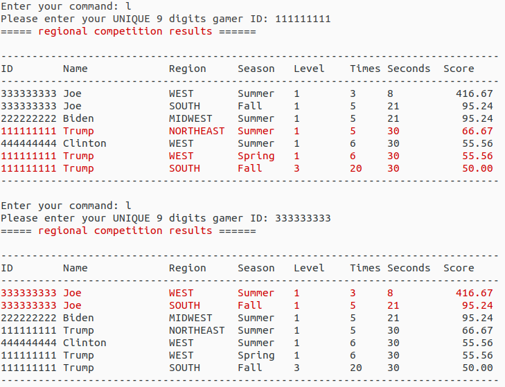
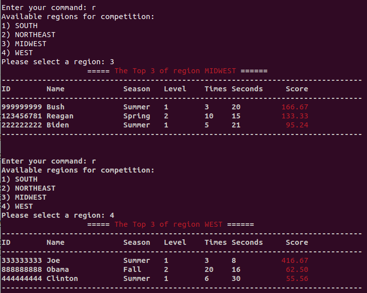
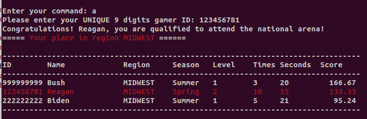
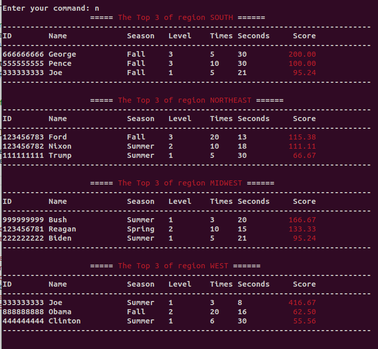
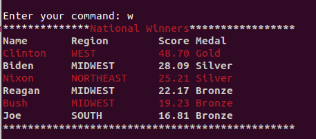

# A National Game of Guessing Numbers

This is a term project, 30% of your final score. It includes 3 stages, each takes 10%. Each stage may consists of one or more scripts.

* **Stage 1**: Build the game logic
* **Stage 2**: Regional competition
* **Stage 3**: National competition 


**How to transfer files between your computer and ember?**

*Prerequisites*

* On Windows: install [Putty](https://www.putty.org/) and add its folder such as "C:\Program Files\PuTTY" to your [PATH environment variale](https://www.computerhope.com/issues/ch000549.htm)

Firstly, cd to the folder containing your script, check you are in the right place with pwd, dir or ls.

* Upload script from your computer to ember
  * On Windows: pscp script yourloginid@ember.hpc.lab:/home/yourloginid/
  * On Mac/Linux:  scp script yourloginid@ember.hpc.lab:/home/yourloginid/
* Download script from ember to your computer
  * On Windows: pscp  yourloginid@ember.hpc.lab:/home/yourloginid/script .
  * On Mac/Linux: scp  yourloginid@ember.hpc.lab:/home/yourloginid/script .

* More information on [pscp](http://xray.rutgers.edu/~matilsky/documents/pscp.htm) and [scp](https://www.baeldung.com/linux/transfer-files-ssh)

## Stage 1: Build the game logic
*check template1 to start*

Write a script implementing the logic of guessing numbers. Below is a list of the requirements:

1. Show a splash of ASCII art followed by its usage once when gamers run this game.

```bash
$ ./guessnumber
    _________¶¶¶111¶¶___________¶¶111¶¶¶¶________
    ______¶¶¶¶1111¶¶¶____________¶¶¶1111¶¶¶1_____
    _____¶¶¶1111¶¶¶¶_____________¶¶¶¶11111¶¶¶____
    ___¶¶¶11¶1¶1¶¶¶¶___¶¶____¶¶__¶¶¶¶¶1¶1¶1¶¶¶1__
    __¶¶¶11¶1¶11¶¶¶¶¶__¶¶¶¶¶¶¶¶__¶¶¶¶¶1¶1¶¶11¶¶1_
    _¶¶¶11¶¶1¶11¶¶¶¶¶¶__¶¶¶¶¶¶_¶¶¶¶¶¶¶1¶¶1¶¶1¶¶¶_
    ¶¶¶¶1¶¶11¶¶1¶¶¶¶¶¶¶¶¶¶¶¶¶¶¶¶¶¶¶¶¶¶1¶¶1¶¶¶1¶¶¶
    ████ █┼█ ███ ███ ███ ┼┼ █┼┼█ █┼█ █▄┼▄█ ██▄ ███ ███
    █┼▄▄ █┼█ █▄┼ █▄▄ █▄▄ ┼┼ ██▄█ █┼█ █┼█┼█ █▄█ █▄┼ █▄┼
    █▄▄█ ███ █▄▄ ▄▄█ ▄▄█ ┼┼ █┼██ ███ █┼┼┼█ █▄█ █▄▄ █┼█
    _¶¶¶1¶¶¶¶1¶¶¶¶¶¶¶¶¶¶¶¶¶¶¶¶¶¶¶¶¶¶¶¶¶¶1¶¶¶¶1¶¶1
    __¶¶1¶¶¶¶¶¶¶¶__¶¶¶¶¶¶¶¶¶¶¶¶¶¶¶__¶¶¶¶¶¶¶¶1¶¶¶_
    ___¶¶1¶¶¶_¶¶_______¶¶¶¶¶¶¶¶______¶¶¶¶¶¶¶¶¶¶__
    ____¶¶¶¶____________¶¶¶¶¶¶___________¶¶¶¶____
    ______¶¶¶__________¶¶¶__¶¶¶__________¶¶______
    _______¶¶¶_________¶______¶_________¶¶¶______
    Usage: use single letter command to play the game
    h - help, show this command list
    e - do exercise by oneself
    c - change game difficulty level
    q - quit the game
    p - participate competition
    s - show my score in descending order
    l - show my place in all gamers
```    
2. Design a game loop, so gamers can choose commands to do various things
3. Implement commands **h, e, c, q** and leave commands **p,s,l**

2.1 command 'h' shows usage of the game and a list of the commands

```bash
Enter your command: h
    Usage: use single letter command to play the game
    h - help, show this command list
    e - do exercise by oneself
    c - change game difficulty level
    q - quit the game
    p - participate competition
    s - show my score in descending order
    l - show my place in all gamers
```

2.2 command 'q' quits the game

```bash
Enter your command: q
Are you sure to quit this game?
1) Y
2) N
Make your choice: 1
```

2.3 command 'c' changes the difficulty level of the game

```bash
Enter your command: c
--- About Difficulty Level ---
Level 1: guess a number between 1 to 100
Level 2: guess a number between 1 to 1000
Level 3: guess a number between 1 to 10000
=== Current Difficulty Level : 1 ===
1) EASY
2) INTERMEDIATE
3) HARD
Select a new difficulty level: 1
=== New Difficulty Level : 1 ===

Enter your command: c
--- About Difficulty Level ---
Level 1: guess a number between 1 to 100
Level 2: guess a number between 1 to 1000
Level 3: guess a number between 1 to 10000
=== Current Difficulty Level : 1 ===
1) EASY
2) INTERMEDIATE
3) HARD
Select a new difficulty level: 2
=== New Difficulty Level : 2 ===

Enter your command: c
--- About Difficulty Level ---
Level 1: guess a number between 1 to 100
Level 2: guess a number between 1 to 1000
Level 3: guess a number between 1 to 10000
=== Current Difficulty Level : 2 ===
1) EASY
2) INTERMEDIATE
3) HARD
Select a new difficulty level: 3
=== New Difficulty Level : 3 ===
```

2.4 command 'e' lets gamers practice their skill

```bash
Enter your command: e                                                         
    __                     _      _                                           
    )_)   _   _   _ )       )    / _  _  |                                    
    / \   )_) (_( (_(  (_(  o    (__/ (_) o                                   
        (_              _)       
=== Current Difficulty Level : 3 ===                                                     
guess a number between 1 to 10000                                             
                                                                              
Your guess: 5000                                                              
too large                                                                     
Your guess: 2000                                                              
too large                                                                     
Your guess: 1000                                                              
too large                                                                     
Your guess: 500                                                               
too large                                                                     
Your guess: 100                                                               
too small                                                                     
Your guess: 200                                                               
too small                                                                     
Your guess: 400                                                               
too large                                                                     
Your guess: 300                                                               
too small                                                                     
Your guess: 350                                                               
too small                                                                     
Your guess: 475                                                               
too large                                                                     
Your guess: 375                                                               
too large                                                                     
Your guess: 360                                                               
too small                                                                     
Your guess: 368                                                               
too small                                                                     
Your guess: 372                                                               
too small                                                                     
Your guess: 374                                                               
too large                                                                     
Your guess: 373                                                               
too small                                                                     
Congratulation! You get it!                                                   
You used 88 seconds, tried 16 times, scored 21.30681818181818181818           
Continue practicing? Enter Y or N:                                            

```

* How to calculate the score? 
  
  $$score=\frac{difficulty\ level * 10000}{seconds\ elapsed * times\ tried}$$  

2.5 unimplemented commands  **p,s,l** show "to be implemented ..."

```bash
Enter your command: s
to do showScore...

```

## Stage 2: Regional competition and database
*check template2 for start*

The national game has 4 seasons: Spring, Summer, Fall and Winter. It is open to anyone in USA. The gamers must compete in the regional arenas first. Each gamer can compete at most 3 times in the regional competition.


Only the top 3 out of each region can compete in the national arena.

The first 3 seasons are for regional competitions. The last season is for the national competition. The top winner will be awarded 1 gold medal. The second 2 winners each will be awarded 1 silver medal. The third 3 winners each will be awarded 1 bronze medal.

1. **Create database**: When starting the game, in the current folder, create a data folder and two text files - regionresults.txt and nationresults.txt if they do not exist. This is done without the gamer's notice. This is a typical step in games for loading data and initializing data structures. To simply our project, we use text files to store game results. You may refer to [Learning Bash File Test Operators With Examples](https://adamtheautomator.com/bash-file-test/).

```bash
# 1.1 At the beginning, there is only the bash script guessnumber2 in the current folder
$ ls
guessnumber2

# 1.2 The data file initialization is done between the splash art and usage infomation
$ ./guessnumber2 
    _________¶¶¶111¶¶___________¶¶111¶¶¶¶________ 
    ______¶¶¶¶1111¶¶¶____________¶¶¶1111¶¶¶1_____ 
    _____¶¶¶1111¶¶¶¶_____________¶¶¶¶11111¶¶¶____ 
    ___¶¶¶11¶1¶1¶¶¶¶___¶¶____¶¶__¶¶¶¶¶1¶1¶1¶¶¶1__ 
    __¶¶¶11¶1¶11¶¶¶¶¶__¶¶¶¶¶¶¶¶__¶¶¶¶¶1¶1¶¶11¶¶1_ 
    _¶¶¶11¶¶1¶11¶¶¶¶¶¶__¶¶¶¶¶¶_¶¶¶¶¶¶¶1¶¶1¶¶1¶¶¶_ 
    ¶¶¶¶1¶¶11¶¶1¶¶¶¶¶¶¶¶¶¶¶¶¶¶¶¶¶¶¶¶¶¶1¶¶1¶¶¶1¶¶¶ 
    ████ █┼█ ███ ███ ███ ┼┼ █┼┼█ █┼█ █▄┼▄█ ██▄ ███ ███
    █┼▄▄ █┼█ █▄┼ █▄▄ █▄▄ ┼┼ ██▄█ █┼█ █┼█┼█ █▄█ █▄┼ █▄┼
    █▄▄█ ███ █▄▄ ▄▄█ ▄▄█ ┼┼ █┼██ ███ █┼┼┼█ █▄█ █▄▄ █┼█
    _¶¶¶1¶¶¶¶1¶¶¶¶¶¶¶¶¶¶¶¶¶¶¶¶¶¶¶¶¶¶¶¶¶¶1¶¶¶¶1¶¶1 
    __¶¶1¶¶¶¶¶¶¶¶__¶¶¶¶¶¶¶¶¶¶¶¶¶¶¶__¶¶¶¶¶¶¶¶1¶¶¶_ 
    ___¶¶1¶¶¶_¶¶_______¶¶¶¶¶¶¶¶______¶¶¶¶¶¶¶¶¶¶__ 
    ____¶¶¶¶____________¶¶¶¶¶¶___________¶¶¶¶____ 
    ______¶¶¶__________¶¶¶__¶¶¶__________¶¶______ 
    _______¶¶¶_________¶______¶_________¶¶¶______
-------------------------------------------
loading data and initialize data structures
./data folder not exist, creating it...
./data folder created.
./data/regionresults.txt not exist, creating it...
./data/regionresults.txt created.
./data/nationresults.txt not exist, creating it...
./data/nationresults.txt created.
-------------------------------------------
    Usage: use single letter command to play the game
    h - help, show this command list
    e - do exercise by oneself
    c - change game difficulty level
    q - quit the game
    p - participate competition
    s - show my score in descending order
    l - show my place in all gamers

Enter your command: ^C

# 1.3 Now the data folder, nationresults.txt, and regionresults.txt are all created
$ tree .
.
├── data
│   ├── nationresults.txt
│   └── regionresults.txt
└── guessnumber2

1 directory, 3 files

# 1.4 All future executions of guessnumbers, 
# it only shows loading data and initialize data structures
$ ./guessnumber2 
    _________¶¶¶111¶¶___________¶¶111¶¶¶¶________ 
    ______¶¶¶¶1111¶¶¶____________¶¶¶1111¶¶¶1_____ 
    _____¶¶¶1111¶¶¶¶_____________¶¶¶¶11111¶¶¶____ 
    ___¶¶¶11¶1¶1¶¶¶¶___¶¶____¶¶__¶¶¶¶¶1¶1¶1¶¶¶1__ 
    __¶¶¶11¶1¶11¶¶¶¶¶__¶¶¶¶¶¶¶¶__¶¶¶¶¶1¶1¶¶11¶¶1_ 
    _¶¶¶11¶¶1¶11¶¶¶¶¶¶__¶¶¶¶¶¶_¶¶¶¶¶¶¶1¶¶1¶¶1¶¶¶_ 
    ¶¶¶¶1¶¶11¶¶1¶¶¶¶¶¶¶¶¶¶¶¶¶¶¶¶¶¶¶¶¶¶1¶¶1¶¶¶1¶¶¶ 
    ████ █┼█ ███ ███ ███ ┼┼ █┼┼█ █┼█ █▄┼▄█ ██▄ ███ ███
    █┼▄▄ █┼█ █▄┼ █▄▄ █▄▄ ┼┼ ██▄█ █┼█ █┼█┼█ █▄█ █▄┼ █▄┼
    █▄▄█ ███ █▄▄ ▄▄█ ▄▄█ ┼┼ █┼██ ███ █┼┼┼█ █▄█ █▄▄ █┼█
    _¶¶¶1¶¶¶¶1¶¶¶¶¶¶¶¶¶¶¶¶¶¶¶¶¶¶¶¶¶¶¶¶¶¶1¶¶¶¶1¶¶1 
    __¶¶1¶¶¶¶¶¶¶¶__¶¶¶¶¶¶¶¶¶¶¶¶¶¶¶__¶¶¶¶¶¶¶¶1¶¶¶_ 
    ___¶¶1¶¶¶_¶¶_______¶¶¶¶¶¶¶¶______¶¶¶¶¶¶¶¶¶¶__ 
    ____¶¶¶¶____________¶¶¶¶¶¶___________¶¶¶¶____ 
    ______¶¶¶__________¶¶¶__¶¶¶__________¶¶______ 
    _______¶¶¶_________¶______¶_________¶¶¶______
-------------------------------------------
loading data and initialize data structures
-------------------------------------------
    Usage: use single letter command to play the game
    h - help, show this command list
    e - do exercise by oneself
    c - change game difficulty level
    q - quit the game
    p - participate competition
    s - show my score in descending order
    l - show my place in all gamers

Enter your command: ^C

```

2. Now we have the pseudo database. Each gamer can compete at most 3 times in the regional competition during any of the Spring, Summer and Fall season. This is done in the **p** command. You may refer to [Grep and Regular Expressions!](https://ryanstutorials.net/linuxtutorial/grep.php) to find all records of a given gamer ID. To extract a specific field from a record, You may refer to [Cut Command in Linux](https://linuxize.com/post/linux-cut-command/).

```bash
# 2.1 Check gamer ID, it should be a unique number of 9 digits
# this can be handled with regular expression
# Don't use your SSN number
Enter your command: p
Welcome to the national game of guessing numbers!
Please enter your UNIQUE 9 digits gamer ID: 123
Your gamer ID 123 is NOT 9 digits!
Please enter your UNIQUE 9 digits gamer ID: abc
Your gamer ID abc is NOT 9 digits!
Please enter your UNIQUE 9 digits gamer ID: abcdefghi 
Your gamer ID abcdefghi is NOT 9 digits!
Please enter your UNIQUE 9 digits gamer ID: 333333333

# 2.2 Once a valid gamer ID is entered and the gamer has NO records
# 2.2.1 Ask the gamer to choose a region
# Wrong choices need to be handled with regular expression
Available regions for competition:
1) SOUTH
2) NORTHEAST
3) MIDWEST
4) WEST
Please select a region: 5
You did't make your choice!
Please select a region: 0
You did't make your choice!
Please select a region: 1
# 2.2.2 Ask the gamer to choose a season
# Wrong choices need to be handled with regular expression
Seasons for regional competition:
1) Spring
2) Summer
3) Fall
Please select a season: 0
You did't make your choice!
Please select a season: 4
You did't make your choice!
Please select a season: 3
# 2.2.3 Ask the gamer to enter name
# Name need to be handled with regular expression, 
# it can contain only letters
Please enter your name: Joe Biden
Your name can contain only letters!
Please enter your name: Joe123
Your name can contain only letters!
Please enter your name: 123Joe
Your name can contain only letters!
Please enter your name: Joe

# 2.2.4 Start guessing a number
    __                     _      _        
    )_)   _   _   _ )       )    / _  _  | 
    / \   )_) (_( (_(  (_(  o    (__/ (_) o 
        (_              _)                 
=== Current Difficulty Level : 1 ===
guess a number between 1 to 100 

Your guess: 50
too small
Your guess: 75
too small
Your guess: 80
too small
Your guess: 90
too large
Your guess: 85
too small
Congratulation! You get it!
You used 21 seconds, tried 5 times, scored 95.23809523809523809523

Enter your command: ^C

# 2.3 Start the game again, if a gamer played 1,or 2 times, 
# get her name from the database and welcome her back
# and show how many times she still can play in the regional arenas
# ask her to choose a region and a season then start guessing a number
Enter your command: p
Welcome to the national game of guessing numbers!
Please enter your UNIQUE 9 digits gamer ID: 333333333
Hello Joe, welcome back!
You have competed 1 times in the regional arenas. You still can compete 2 times in the regional arenas.
Available regions for competition:
1) SOUTH
2) NORTHEAST
3) MIDWEST
4) WEST
Please select a region: 4
Seasons for regional competition:
1) Spring
2) Summer
3) Fall
Please select a season: 2
    __                     _      _        
    )_)   _   _   _ )       )    / _  _  | 
    / \   )_) (_( (_(  (_(  o    (__/ (_) o 
        (_              _)                 
=== Current Difficulty Level : 1 ===
guess a number between 1 to 100 

Your guess: 50
too large
Your guess: 25
too small
Your guess: 30
too small
Congratulation! You get it!
You used 8 seconds, tried 3 times, scored 416.66666666666666666666

Enter your command: ^C

# 2.4 Each regional competition result is saved as a csv record
$ cat ./data/regionresults.txt 
111111111,Trump,SOUTH,Fall,3,20,30,50.0000000
111111111,Trump,NORTHEAST,Summer,1,5,30,66.66666666666666666666
111111111,Trump,WEST,Spring,1,6,30,55.55555555555555555555
222222222,Biden,MIDWEST,Summer,1,5,21,95.23809523809523809523
333333333,Joe,SOUTH,Fall,1,5,21,95.23809523809523809523
333333333,Joe,WEST,Summer,1,3,8,416.66666666666666666666
#gamerID,gamerName,region,season,difficulty level,times tried,seconds elapsed,score

# 2.5 If a gamer played 3 times in regional arenas
# prompt her that she can only participate national arena if qualified
Enter your command: p
Welcome to the national game of guessing numbers!
Please enter your UNIQUE 9 digits gamer ID: 111111111
Hello Trump, welcome back!
You have competed 3 times in the regional arenas, please participate the national arena if you are qualified.

```

3. Implement the **s** command to show my regional scores in descending order. You may refer to [Pretty print table with awk](https://stackoverflow.com/questions/6262838/pretty-print-table-with-awk), [How to Sort in Linux Bash by Column](https://linuxhint.com/sort-bash-column-linux/) and [How can I sort numbers in a unix shell?](https://unix.stackexchange.com/questions/355266/how-can-i-sort-numbers-in-a-unix-shell)

```bash
# 3. Show regional scores of a given gamer ID in descending order
# 3.1 If no record for this gamer ID, ask the gamer to participate regional competition
Enter your command: s
Please enter your UNIQUE 9 digits gamer ID: 123456789

You did NOT participate any regional arenas yet.
 Please participate regional arenas first.
 Good luck!

# 3.2 If there are records, 
# 3.2.1 show the records in descending order on score
# 3.2.2 using a formatted table
# 3.2.3 Scores must be shown only 2 digits after the decimal point
# 3.2.4 AND BE RIGHT ALIGNED, ALL OTHER FIELDS ARE LEFT ALIGNED
Enter your command: s
Please enter your UNIQUE 9 digits gamer ID: 111111111
Hello Trump, here are your competitions

-------------------------------------------------
Region     Season   Level    Times Seconds  Score   
-------------------------------------------------
NORTHEAST  Summer   1        5     30       66.67   
WEST       Spring   1        6     30       55.56   
SOUTH      Fall     3        20    30       50.00   
-------------------------------------------------

Enter your command: s
Please enter your UNIQUE 9 digits gamer ID: 222222222
Hello Biden, here are your competitions

-------------------------------------------------
Region     Season   Level    Times Seconds  Score   
-------------------------------------------------
MIDWEST    Summer   1        5     21       95.24   
-------------------------------------------------

Enter your command: s
Please enter your UNIQUE 9 digits gamer ID: 333333333
Hello Joe, here are your competitions

-------------------------------------------------
Region     Season   Level    Times Seconds  Score   
-------------------------------------------------
WEST       Summer   1        3     8       416.67  
SOUTH      Fall     1        5     21       95.24   
-------------------------------------------------


```

4. Implement the **l** command to show my place. Refer to [How to change the output color of echo in Linux](https://stackoverflow.com/questions/5947742/how-to-change-the-output-color-of-echo-in-linux) and [Bash Pass Shell Variables To Awk Using -v Option](https://www.cyberciti.biz/faq/linux-unix-appleosx-bsd-bash-passing-variables-to-awk/)

```bash
# 4.1 If no record for this gamer ID, ask the gamer to 
# participate regional competition as the previous task
Enter your command: l
Please enter your UNIQUE 9 digits gamer ID: 123456789

You did NOT participate any regional arenas yet.
 Please participate regional arenas first.
 Good luck!

# 4.2 If there are records, 
# 4.2.1 show the records in descending order on score
# 4.2.2 using a formatted table
# 4.2.3 Scores must be shown only 2 digits after the decimal point
# 4.2.4 AND BE RIGHT ALIGNED, ALL OTHER FIELDS ARE LEFT ALIGNED
# 4.2.5 THE GAMER'S SCORES MUST BE HIGHLIGHTED!

```



## Stage 3: National competition
Only the top 3 out of each region can compete in the national arena.

The Winter season is for the national competition. The top winner will be awarded 1 gold medal. The second 2 winners each will be awarded 1 silver medal. The third 3 winners each will be awarded 1 bronze medal.

1. Add **5 more commands** into the help menu and the main game logic.
```
   r - show regional top three in descending order
   a - check my qualification of attending national arena
   n - show national competitors
   P - participate national competition
   w - print national winners
```

```bash
1.1 Show the 5 more new commands into the help information

    Usage: use single letter command to play the game
    h - help, show this command list
    e - do exercise by oneself
    c - change game difficulty level
    q - quit the game
    p - participate regional competition
    s - show my score in descending order
    l - show my place in all gamers
    r - show regional top three in descending order
    a - check my qualification of attending national arena
    n - show national competitors
    P - participate national competition
    w - print national winners

1.2 Add the 5 more new commands into the main game logic so
    the gamer can choose and execute each of them
```

2. Implement the command **r** showing regional top three in descending order
   1. For a gamer played multiple times in this region, use her highest score only
   2. Highlight the title and scores as the sample image below 

Hints:

* Find all records of a region, for example: 
```bash
egrep "\<WEST\>" ./data/regionresults.txt
```
* Sort the records in descending order on score: 
```bash
egrep "\<WEST\>" ./data/regionresults.txt  | sort  -t ',' -rn -k 8,8
```
* For multiple-time players, keep only their first records, i.e. their highest records. You may refer to [Sort CSV file by multiple columns using the "sort" command](https://stackoverflow.com/questions/9471101/sort-csv-file-by-multiple-columns-using-the-sort-command) for further information.
```bash
egrep "\<WEST\>" ./data/regionresults.txt  | sort  -t ',' -rn -k 8,8 | awk -F, '!a[$1]++'
```
* Then keep only the top three
```bash
egrep "\<WEST\>" ./data/regionresults.txt  | sort  -t ',' -rn -k 8,8 | awk -F, '!a[$1]++' | head -n 3 
```

* **Note:** 
  * **1. There could be a tie, you are NOT required to solve this, simply keep the top three.**
  * **2. A gamer is forbidden to play in more than one region, you are NOT reqired to solve that in the r command**



3. Implement the command **a** of checking my qualification of attending national arena
   1. If I attended more than one regional arena, then I am disqualified
   2. If I did not attend any regional arena, I am asked to do that first
   3. If I am qualified, highlight my place in the top three

```bash
# 3.1 If I attended more than one regional arena, then I am disqualified

Enter your command: a
Please enter your UNIQUE 9 digits gamer ID: 111111111
Dear Trump, You competed in 3 regions so you are DISQUALIFIED! 

Below are your records:
-----------------------------------------------------
Region     Season   Level    Times Seconds  Score   
-----------------------------------------------------
NORTHEAST  Summer   1        5     30          66.67
WEST       Spring   1        6     30          55.56
SOUTH      Fall     3        20    30          50.00
-----------------------------------------------------

Enter your command: a
Please enter your UNIQUE 9 digits gamer ID: 333333333
Dear Joe, You competed in 2 regions so you are DISQUALIFIED! 

Below are your records:
-----------------------------------------------------
Region     Season   Level    Times Seconds  Score   
-----------------------------------------------------
WEST       Summer   1        3     8          416.67
SOUTH      Fall     1        5     21          95.24
-----------------------------------------------------

# 3.2 If I did not attend any regional arena, I am asked to do that first
Enter your command: a
Please enter your UNIQUE 9 digits gamer ID: 112233445

You did NOT participate any regional arenas yet.
 Please participate regional arenas first.
 Good luck!

# If I am qualified, highlight my place in the top three
```



4. Implement the command **n** to show national competitors from each region. 
    Hints: reuse the **r** command.



5. Implement the command **P** to participate national competition
   1. If the gamer has no regional records, ask her to participate regional arenas first
   2. The gamer attended multiple regions is automatically disqualified
   3. A gamer who is not in the top three of his region is not qualified
   4. A gamer can play only once in the national arena
   5. A qualified gamer can play once in the national arena
      1. The diffcult level is set to be 3 automatically
      2. No region or season selection
      3. Welcome the gamer with his/her name, then let he/she play the game
      4. The result is saved in the nationresults.txt


```bash
# 5.1 If the gamer has no regional records, ask her to participate regional arenas first
Enter your command: P
Please enter your UNIQUE 9 digits gamer ID: 123456789

You did NOT participate any regional arenas yet.
 Please participate regional arenas first.
 Good luck!

# 5.2 The gamer attended multiple regions is automatically disqualified
Enter your command: P
Please enter your UNIQUE 9 digits gamer ID: 111111111
Dear Trump, you are DISQUALIFIED because you competed in 3 regions! 

Below are your records:
-----------------------------------------------------
Region     Season   Level    Times Seconds  Score   
-----------------------------------------------------
NORTHEAST  Summer   1        5     30          66.67
WEST       Spring   1        6     30          55.56
SOUTH      Fall     3        20    30          50.00
-----------------------------------------------------

# 5.3 A gamer who is not in the top three of his region is not qualified
Enter your command: P
Please enter your UNIQUE 9 digits gamer ID: 123456784
Hello Kennedy, you are not in the top 3 of the WEST arena!

# 5.4 A gamer can play only once in the national arena
Enter your command: P
Please enter your UNIQUE 9 digits gamer ID: 555555555
Hello Pence, you can play only ONCE in the national arena!

# 5.5 A qualified gamer can play once in the national arena
# 5.5.1 The diffcult level is set to be 3 automatically
# 5.5.2 No region or season selection
# 5.5.3 Welcome the gamer with his/her name, then let he/she play the game
Enter your command: P
Please enter your UNIQUE 9 digits gamer ID: 444444444
Hello Clinton, Welcome to the National arena of guessing numbers!
    __                     _      _        
    )_)   _   _   _ )       )    / _  _  | 
    / \   )_) (_( (_(  (_(  o    (__/ (_) o 
        (_              _)                 
=== Current Difficulty Level : 3 ===
guess a number between 1 to 10000 

Your guess: 5000
too small
Your guess: 8000
too small
Your guess: 9000
too small
Your guess: 9500
too small
Your guess: 9800
too large
Your guess: 9700
too small
Your guess: 9800
too large
Your guess: 9750
too small
Your guess: 9780
too small
Your guess: 9790
too large
Your guess: 9785
too small
Congratulation! You get it!
You used 56 seconds, tried 11 times, scored 48.70129870129870129870


# 5.5.4 The result is appended in the nationresults.txt
$ tail -n 2 data/nationresults.txt 
123456782,Nixon,NORTHEAST,10,119,25.210084033613445
444444444,Clinton,WEST,11,56,48.70129870129870129870
#gamerID,name,region,times tried,seconds elapsed,score

```

6. Implement the **w** command to print national winners
   1. The top winner will be awarded 1 gold medal. 
   2. The second 2 winners each will be awarded 1 silver medal. 
   3. The third 3 winners each will be awarded 1 bronze medal.
   4. Alternate the color of each row

* **Note:** 
  * **1. There could be a tie, you are NOT required to solve this, simply keep the top six.**



**Hints: how to alternate the color of rows?**

```bash
awk -F, -v red="$RED" -v white="$WHITE"  '
    BEGIN{
        medals="Gold,Silver,Silver,Bronze,Bronze,Bronze"; split(medals,medal,",");
    } 
    {
        if(NR % 2)
            printf("%s%-10s %-10s %8.2f %-8s%s\n", red, $2, $3, $6, medal[NR],white );
        else
            printf("%-10s %-10s %8.2f %-8s\n", $2, $3, $6, medal[NR] );
    }
    '
```

## Reference
* Bash tips
  * [Generate a random number in bash](https://linuxhint.com/generate-random-number-bash/)
  * [Bash lowercase and uppercase strings](https://linuxhint.com/bash_lowercase_uppercase_strings/)
  * [Here Document And Here String](https://www.baeldung.com/linux/heredoc-herestring)
* Text Art
  * [Text Art Generator](https://www.textartgenerator.net/)
  * [ASCII-Generator](https://ascii-generator.site/t/)
  * [Ascii Art creator ](https://www.ascii-art-generator.org/)
* How to debug bash script
  * [Debugging a Bash Script](https://www.baeldung.com/linux/debug-bash-script)
  * [Debugging Bash scripts](https://tldp.org/LDP/Bash-Beginners-Guide/html/sect_02_03.html)