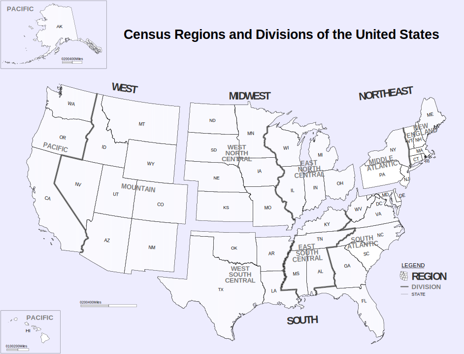

# A National Game of Guessing Numbers

This is a term project, 30% of your final score. It includes 3 stages, each takes 10%. Each stage may consists of one or more scripts.

* **Stage 1**: Build the game logic
* **Stage 2**: Build the game arrangement
* **Stage 3**: Carry out various statistics on the game results 


**How to transfer files between your computer and ember?**

*Prerequisites*

* On Windows: install [Putty](https://www.putty.org/) and add its folder such as "C:\Program Files\PuTTY" to your [PATH environment variale](https://www.computerhope.com/issues/ch000549.htm)

Firstly, cd to the folder containing your script, check you are in the right place with pwd, dir or ls.

* Upload script from your computer to ember
  * On Windows: pscp script yourloginid@ember.hpc.lab:/home/yourloginid/
  * On Mac/Linux:  scp script yourloginid@ember.hpc.lab:/home/yourloginid/
* Download script from ember to your computer
  * On Windows: pscp  yourloginid@ember.hpc.lab:/home/yourloginid/script .
  * On Mac/Linux: scp  yourloginid@ember.hpc.lab:/home/yourloginid/script .

* More information on [pscp](http://xray.rutgers.edu/~matilsky/documents/pscp.htm) and [scp](https://www.baeldung.com/linux/transfer-files-ssh)

## Stage 1: Build the game logic

Write a script implementing the logic of guessing numbers. Below is a list of the requirements:

1. Show a splash of ASCII art followed by its usage once when gamers run this game.

```bash
$ ./guessnumber
    _________¶¶¶111¶¶___________¶¶111¶¶¶¶________
    ______¶¶¶¶1111¶¶¶____________¶¶¶1111¶¶¶1_____
    _____¶¶¶1111¶¶¶¶_____________¶¶¶¶11111¶¶¶____
    ___¶¶¶11¶1¶1¶¶¶¶___¶¶____¶¶__¶¶¶¶¶1¶1¶1¶¶¶1__
    __¶¶¶11¶1¶11¶¶¶¶¶__¶¶¶¶¶¶¶¶__¶¶¶¶¶1¶1¶¶11¶¶1_
    _¶¶¶11¶¶1¶11¶¶¶¶¶¶__¶¶¶¶¶¶_¶¶¶¶¶¶¶1¶¶1¶¶1¶¶¶_
    ¶¶¶¶1¶¶11¶¶1¶¶¶¶¶¶¶¶¶¶¶¶¶¶¶¶¶¶¶¶¶¶1¶¶1¶¶¶1¶¶¶
    ████ █┼█ ███ ███ ███ ┼┼ █┼┼█ █┼█ █▄┼▄█ ██▄ ███ ███
    █┼▄▄ █┼█ █▄┼ █▄▄ █▄▄ ┼┼ ██▄█ █┼█ █┼█┼█ █▄█ █▄┼ █▄┼
    █▄▄█ ███ █▄▄ ▄▄█ ▄▄█ ┼┼ █┼██ ███ █┼┼┼█ █▄█ █▄▄ █┼█
    _¶¶¶1¶¶¶¶1¶¶¶¶¶¶¶¶¶¶¶¶¶¶¶¶¶¶¶¶¶¶¶¶¶¶1¶¶¶¶1¶¶1
    __¶¶1¶¶¶¶¶¶¶¶__¶¶¶¶¶¶¶¶¶¶¶¶¶¶¶__¶¶¶¶¶¶¶¶1¶¶¶_
    ___¶¶1¶¶¶_¶¶_______¶¶¶¶¶¶¶¶______¶¶¶¶¶¶¶¶¶¶__
    ____¶¶¶¶____________¶¶¶¶¶¶___________¶¶¶¶____
    ______¶¶¶__________¶¶¶__¶¶¶__________¶¶______
    _______¶¶¶_________¶______¶_________¶¶¶______
    Usage: use single letter command to play the game
    h - help, show this command list
    e - do exercise by oneself
    c - change game difficulty level
    q - quit the game
    p - participate competition
    s - show my score in descending order
    l - show my place in all gamers
```    
2. Design a game loop, so gamers can choose commands to do various things
3. Implement commands **h, e, c, q** and leave commands **p,s,l**

2.1 command 'h' shows usage of the game and a list of the commands

```bash
Enter your command: h
    Usage: use single letter command to play the game
    h - help, show this command list
    e - do exercise by oneself
    c - change game difficulty level
    q - quit the game
    p - participate competition
    s - show my score in descending order
    l - show my place in all gamers
```

2.2 command 'q' quits the game

```bash
Enter your command: q
Are you sure to quit this game?
1) Y
2) N
Make your choice: 1
```

2.3 command 'c' changes the difficulty level of the game

```bash
Enter your command: c
--- About Difficulty Level ---
Level 1: guess a number between 1 to 100
Level 2: guess a number between 1 to 1000
Level 3: guess a number between 1 to 10000
=== Current Difficulty Level : 1 ===
1) EASY
2) INTERMEDIATE
3) HARD
Select a new difficulty level: 1
=== New Difficulty Level : 1 ===

Enter your command: c
--- About Difficulty Level ---
Level 1: guess a number between 1 to 100
Level 2: guess a number between 1 to 1000
Level 3: guess a number between 1 to 10000
=== Current Difficulty Level : 1 ===
1) EASY
2) INTERMEDIATE
3) HARD
Select a new difficulty level: 2
=== New Difficulty Level : 2 ===

Enter your command: c
--- About Difficulty Level ---
Level 1: guess a number between 1 to 100
Level 2: guess a number between 1 to 1000
Level 3: guess a number between 1 to 10000
=== Current Difficulty Level : 2 ===
1) EASY
2) INTERMEDIATE
3) HARD
Select a new difficulty level: 3
=== New Difficulty Level : 3 ===
```

2.4 command 'e' lets gamers practice their skill

```bash
Enter your command: e                                                         
    __                     _      _                                           
    )_)   _   _   _ )       )    / _  _  |                                    
    / \   )_) (_( (_(  (_(  o    (__/ (_) o                                   
        (_              _)       
=== Current Difficulty Level : 3 ===                                                     
guess a number between 1 to 10000                                             
                                                                              
Your guess: 5000                                                              
too large                                                                     
Your guess: 2000                                                              
too large                                                                     
Your guess: 1000                                                              
too large                                                                     
Your guess: 500                                                               
too large                                                                     
Your guess: 100                                                               
too small                                                                     
Your guess: 200                                                               
too small                                                                     
Your guess: 400                                                               
too large                                                                     
Your guess: 300                                                               
too small                                                                     
Your guess: 350                                                               
too small                                                                     
Your guess: 475                                                               
too large                                                                     
Your guess: 375                                                               
too large                                                                     
Your guess: 360                                                               
too small                                                                     
Your guess: 368                                                               
too small                                                                     
Your guess: 372                                                               
too small                                                                     
Your guess: 374                                                               
too large                                                                     
Your guess: 373                                                               
too small                                                                     
Congratulation! You get it!                                                   
You used 88 seconds, tried 16 times, scored 21.30681818181818181818           
Continue practicing? Enter Y or N:                                            

```

* How to calculate the score? 
  
  $$score=\frac{difficulty\ level * 10000}{seconds\ elapsed * times\ tried}$$  

2.5 unimplemented commands  **p,s,l** show "to be implemented ..."

```bash
Enter your command: s
to do showScore...

```

## Stage 2
The national game has 4 seasons: Spring, Summer, Fall and Winter. It is open to anyone in USA. The gamers must compete in the regional arenas first. 



Only the top 5 out of each region can compete in the national arena.

The first 3 seasons are for regional competitions. The last season is for the national competition. The top winner will be awarded 1 gold medal. The second 2 winners each will be awarded 1 silver medal. The third 3 winners each will be awarded 1 bronze medal.

## Stage 3


## Reference
* Bash tips
  * [Generate a random number in bash](https://linuxhint.com/generate-random-number-bash/)
  * [Bash lowercase and uppercase strings](https://linuxhint.com/ba   sh_lowercase_uppercase_strings/)
  * [Here Document And Here String](https://www.baeldung.com/linux/heredoc-herestring)
* Text Art
  * [Text Art Generator](https://www.textartgenerator.net/)
  * [ASCII-Generator](https://ascii-generator.site/t/)
  * [Ascii Art creator ](https://www.ascii-art-generator.org/)