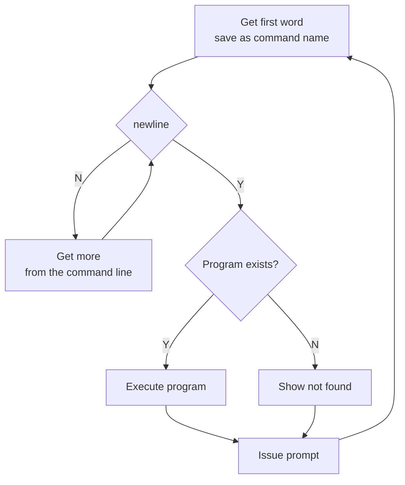

# Shell and Git
*chapter 5*

* [Linux man pages](https://linux.die.net/man/)

## ToC
* Two frequent directories
  * The working directory
  * Your home directory
* The command line
  * builtins and external commands
  * Pipelines
  * Standard input, standard ouput and standard error
  * redirection
  * Filename generation and pathname expansion
* Job and process management
  * Running a command in the background
  * Aborting a background job

## Topics
### Shells
* Popular [shells](https://en.wikipedia.org/wiki/Shell_(computing)):
  * [bash](https://www.gnu.org/software/bash/)
  * [zsh](https://www.zsh.org/)
  * [csh](http://bxr.su/NetBSD/bin/csh/)
  * [tcsh](https://www.tcsh.org/)
  * [fish](https://fishshell.com/)

* Special characters
> & ; | * ? ' " ` [ ] ( ) $ < > { } # / \ ! ~

  * whitespace or blank
    * RETURN, ends a command line
    * SPACE, TAB separate tokens on the command line
  * to use special characters as regular characters
    * quote them with single quotation marks
    * escape them with backslash
  * The only way to quote the erase character (CONTROL-H), the line kill character (CONTROL-U), and other control characters (try CONTROL-M) is by preceding each with a CONTROL-V. Single quotation marks and backslashes do not work. 

```bash
echo 'the erase character CONTROL-U' # we can't complete the right quote
echo 'the erase character CONTROL-V CONTROL-U' | hexdump -C # 
```

* [Everything is a file](https://www.geeksforgeeks.org/how-to-find-out-file-types-in-linux/)
  * Regular files: or simply files, they hold documents, pictures, programs, and other kinds of data. 
  * Directory files: or directories or folders, can hold ordinary files and other directory files.
  * Special files and their notation letters in the output of ls -l
    * d: directory
    * b: block device
    * c: character device
    * p: pipe or FIFO
    * l: symbol link
    * s: socket

```bash
# How to find file types
# file - Determine type of FILEs.
file myfile

file -f a-file-contains-the-names-of-other-files

file -s /dev/sda # treat a special file as a normal file

# find out directory files
ls -l / | grep ^d
# find out block device files
ls -l /dev | grep ^b
# find out character device files
ls -l /dev | grep ^c
# find out pipe files
ls -l /dev | grep ^p
# make a named pipe
mkfifo pipename # needs root priviledge
# find out symbol link files
ls -l /dev | grep ^l
# find out socket files
ls -l | grep ^s

# find files with specified types
find /dev -type s

# popular directories
# show the current/working directory
pwd

# home directory
# go to my home directory
cd
cd ~
# go to someone else's home folder
cd ~someone
# the universal writable folder /tmp
ls -ld /tmp
mkdir /tmp/playground
```

* [command line](https://docs.microsoft.com/en-us/windows-server/administration/windows-commands/command-line-syntax-key) composition: a line typed in a terminal ended with newline by pressing ENTER

```bash
# 1. simple commands: switch is also called option or flag, sw and arg are all called token
# Syntax: command [sw1] [sw2] ... [swn] [arg1] [arg2] ... [argn]
adduser --help
# Usage
du --help

# pass variables to simple commands
var1=value1 ... varn=valuen env

# The shell does not require command name to appear first
# redirections and their parameters are processed before the command
>outputfile <inputfile cat 

```


# 2. pipelines


# 3. compound commands or list

```

### Git
[Git](https://git-scm.com/)


## References
* [The Linux Command Line](http://linuxcommand.org/tlcl.php)
* [Bash Shell Scripting](https://en.wikibooks.org/wiki/Bash_Shell_Scripting)
* [A Visual Git Reference](https://marklodato.github.io/visual-git-guide/index-en.html)