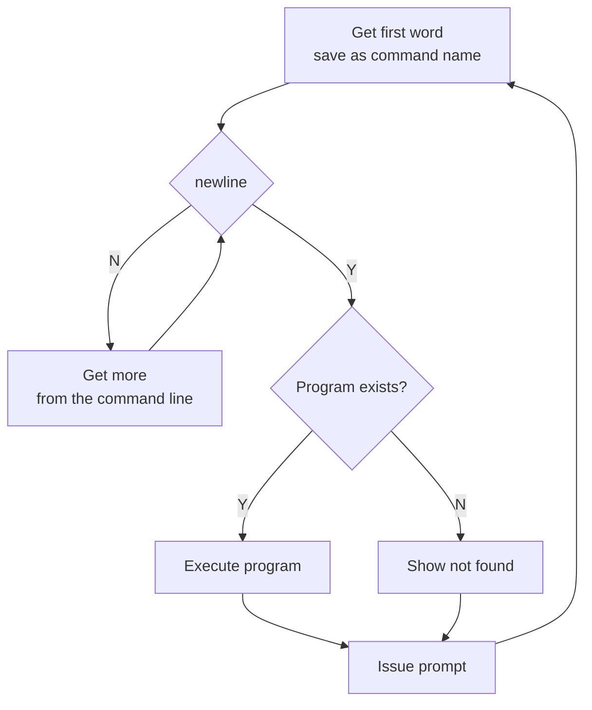
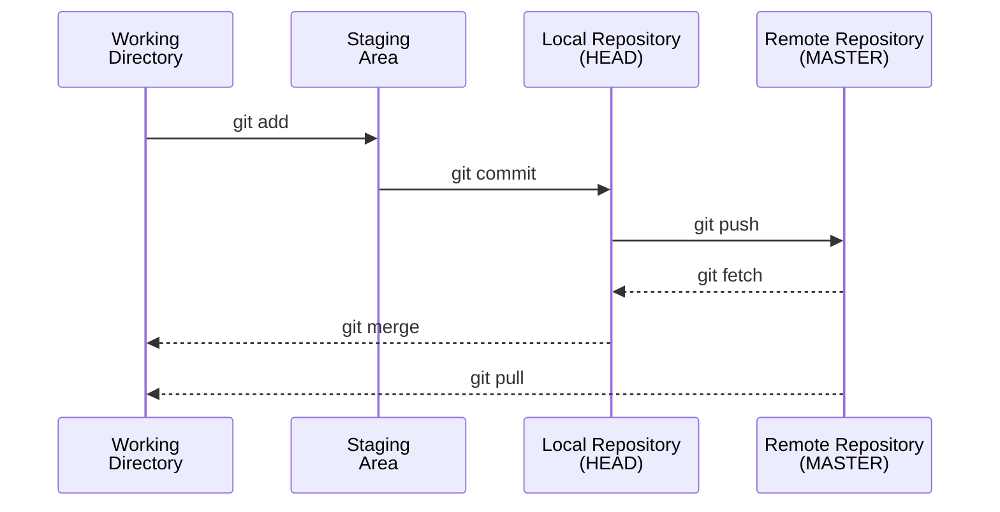

# Shell and Git
*chapter 5*

* [Linux man pages](https://linux.die.net/man/)

## ToC
* Two frequent directories
  * The working directory
  * Your home directory
* The command line
  * builtins and external commands
  * Pipelines
  * Standard input, standard ouput and standard error
  * redirection
  * Filename generation and pathname expansion
* Job and process management
  * Running a command in the background
  * Aborting a background job

## Topics
### Shells
* Popular [shells](https://en.wikipedia.org/wiki/Shell_(computing)):
  * [bash](https://www.gnu.org/software/bash/)
  * [zsh](https://www.zsh.org/)
  * [csh](http://bxr.su/NetBSD/bin/csh/)
  * [tcsh](https://www.tcsh.org/)
  * [fish](https://fishshell.com/)

* Special characters
> & ; | * ? ' " ` [ ] ( ) $ < > { } # / \ ! ~

  * whitespace or blank
    * RETURN, ends a command line
    * SPACE, TAB separate tokens on the command line
  * to use special characters as regular characters
    * quote them with single quotation marks
    * escape them with backslash
  * The only way to quote the erase character (CONTROL-H), the line kill character (CONTROL-U), and other control characters (try CONTROL-M) is by preceding each with a CONTROL-V. Single quotation marks and backslashes do not work. 

```bash
echo 'the erase character CONTROL-U' # we can't complete the right quote
echo 'the erase character CONTROL-V CONTROL-U' | hexdump -C # 
```

### [Everything is a file](https://www.geeksforgeeks.org/how-to-find-out-file-types-in-linux/)
  * Regular files: or simply files, they hold documents, pictures, programs, and other kinds of data. 
  * Directory files: or directories or folders, can hold ordinary files and other directory files.
  * Special files and their notation letters in the output of ls -l
    * d: directory
    * b: block device
    * c: character device
    * p: pipe or FIFO
    * l: symbol link
    * s: socket

```bash
# How to find file types
# file - Determine type of FILEs.
file myfile

file -f a-file-contains-the-names-of-other-files

file -s /dev/sda # treat a special file as a normal file

# find out directory files
ls -l / | grep ^d
# find out block device files
ls -l /dev | grep ^b
# find out character device files
ls -l /dev | grep ^c
# find out pipe files
ls -l /dev | grep ^p
# make a named pipe
mkfifo pipename # needs root priviledge
# find out symbol link files
ls -l /dev | grep ^l
# find out socket files
ls -l | grep ^s

# find files with specified types
find /dev -type s

# popular directories
# show the current/working directory
pwd

# home directory
# go to my home directory
cd
cd ~
# go to someone else's home folder
cd ~someone
# the universal writable folder /tmp
ls -ld /tmp
mkdir /tmp/playground
```

### [command line](https://docs.microsoft.com/en-us/windows-server/administration/windows-commands/command-line-syntax-key) composition: a line typed in a terminal ended with newline by pressing ENTER

* simple commands
```bash
# simple commands: switch is also called option or flag, sw and arg are all called token
# Syntax: command [sw1] [sw2] ... [swn] [arg1] [arg2] ... [argn]
adduser --help
# Usage
du --help

# pass variables to simple commands
var1=value1 ... varn=valuen env

# The shell does not require command name to appear first
# redirections and their parameters are processed before the command
>outputfile <inputfile cat 

```

* Command line processing
  * The shell starts a new process to execute the command
  * A process is the execution of a command by Linux
  * The shell makes each command-line argument, including options and the name of the command, available to the called program
  * While the command is executing, the shell waits for the process to finish. At this point the shell is in an inactive state named sleep. 
  * When the program finishes execution, it passes its exit status  to the shell. 
  * The shell then returns to an active state (wakes up), issues a prompt, and waits for another command.
  * The shell does not process command-line arguments but merely passes them to the called program, the shell has no way of knowing whether a particular option or other argument is valid for a given program. 
  * Any error or usage messages about options or arguments come from the program itself. 
  * Some utilities ignore bad options



* Standard Input and Standard Output
  * Standard output is a place to which a program can send information
  * Standard input is a place a program gets information from
  * Standard error is a place to which a program can send error messages

* The Keyboard and Screen as Standard Input and Standard Output

```bash
# cat copies standard input to standard output, one line at a time
cat
# CONTROL-D signals EOF
```
* Redirection

```bash
#  command [arguments] > filename
cal > today

# concatenate
cal >> today

#  command [arguments] < filename
cat < today

# noclobber: Prevents Overwriting Files
touch myfile
set -o noclobber # enable

date > myfile
date >| myfile # override noclobber

# noclobber does not stop you from overwriting a file using cp or mv

set +o noclobber #disable
date > myfile

# three special device
# the /dev/null device is a data sink, commonly referred to as a bit bucket.
cat myfile >/dev/null

# the /dev/zero device
dd if=/dev/zero of=allzeroes bs=1k count=1

# the /dev/random device
dd if=/dev/random bs=16 count=1 | hexdump -C
```


* pipelines

  * Composed as: 
  simple-command1 | simple-command2
  * Equi-effect to: 
  simple-command1 > tempfile
  simple-command2 < tempfile
  rm tempfile
  * Syntax: [time] [!] simple-command1 [| or |& simple-command2 ... ]
    * time is an optional utility that summarizes the system resources used by the pipeline, 
    * ! logically negates the exit status returned by the pipeline
    * The |& control operator is short for 2>&1 
    * The exit status of a pipeline is the exit status of the last simple command unless pipefail is set
      * in which case the exit status is the rightmost simple command that failed (returned a nonzero exit status) or zero if all simple commands completed successfully
    * Commands that accept input from *files or standard input* can be used in pipeline
    * The pipe symbol (|) implies continuation

```bash
# popular commands that accept input from both stdard input and pipeline
# tr - Translate, squeeze, and/or delete characters from standard input,
# writing to standard output
tr a-z A-Z
tr a-z A-Z afile

# lpr - line printer
lpr afile
ls | lpr

# sort - Write sorted concatenation of all input to standard output
sort
who | sort

# grep - Search for PATTERNS in each FILE
grep -i o
who | grep root

# more and less

cat /etc/passwd | less

# The pipe symbol (|) implies continuation
cat /etc/passwd |

# tee - sends its output to a file and to standard output
who | tee afile | grep root

```

* compound commands or list: A list is one or more pipelines (including simple commands), each separated from the next by one of the following control operators: 
> ;, &, &&, or ||.

* job management

```bash
sleep 500 &
jobs
sleep 500
CTRL+Z
bg
fg %jobid
CTRL+C
kill %jobid
ps
```

* whildcards (or metacharacters) for filename generation/pathname expansion
  * Filenames that contain these special characters are called *ambiguous file references*
  * The process the shell performs on these filenames is called *pathname expansion or globbing*
  * The shell does the expansion not the program that the shell runs

```
? - match a single character
* - 0 or more characters
[] - character set
[^], [!] - character-set negation
```

```bash
touch wood{1..5}leaf{a..h} cake{4..8} cake{4..8}a
ls cake?
ls wood?leaf?
echo cake?a

echo woo*leaf?
echo cake*
echo .*

ls cake[45]
ls cake[^45]

# escape wildcards
echo cake\?
```
### Git
[Git](https://git-scm.com/)

#### Git workflow



#### Git basics
* Create a [Github account](https://github.com/join).
* Check git
  ```bash
  git --version
  ```
* Config user name and email
  ```bash
  git config --global user.name "your username"
  git config --global user.email "your email"
  # check the configuration
  git config --global --list
  ```
* [Generate a SSH key](https://docs.github.com/en/authentication/connecting-to-github-with-ssh/generating-a-new-ssh-key-and-adding-it-to-the-ssh-agent)
  ```bash
  ssh-keygen -t ed25519 -C "your_email"
  # save it in the default location
  # protect it with a passphrase
  ```
* Adding your SSH key to the ssh-agent
  ```bash
  # Start the ssh-agent in the background.
  eval "$(ssh-agent -s)"
  # Add your SSH private key to the ssh-agent.
  ssh-add ~/.ssh/id_ed25519
  ```
* [Adding a new SSH key to your GitHub account](https://docs.github.com/en/authentication/connecting-to-github-with-ssh/adding-a-new-ssh-key-to-your-github-account)
  ```bash
  cat ~/.ssh/id_ed25519.pub
  ```
* [Testing your SSH connection](https://docs.github.com/en/authentication/connecting-to-github-with-ssh/testing-your-ssh-connection)
  ```bash
  ssh -T git@github.com
  ```
* [Create a new remote repository on GitHub](https://github.com/new)
* Create a local repository
  ```bash
  mkdir project1
  cd project1
  cat > README.md # To create a README file for the repository
  git init # Initiates an empty git repository
  ```
* Add files to the Staging Area for commit
  ```bash
  git add . # stage all new and modified files in the local repo for commit

  git status # Lists all new or modified files to be committed
  ```
* Commit staged files to the local repo
  ```bash
  git commit -m "Setup project"

  # the most recent commit
  git reset HEAD~1
  ```
* Add a remote origin and push
  ```bash
  # set the new remote
  git remote add origin git@github.com:yourgithubaccount/reponame.git
  # git remote command lets you create, view, and delete connections to other repositories.
  git remote -v # list connections

  # pushes the changes in the local repository up to the remote repository 
  git push -u origin main # push changes to origin
  ```
* View file modifications
  ```bash
  # # To show the files changes not yet staged
  git diff
  ```
* Revert back to the last committed version
  ```bash
  # all files
  git checkout .
  # a specific file
  git checkout -- thefile
  git status
  ```
* View commit history
  ```bash
  git log
  ```
* The most frequently used commands
  ```bash
  git add .
  git status
  git commit -m'what is about this commit'
  git push
  ```
* Collaborate with others
  *  [add collaborator for the repository](https://help.github.com/articles/inviting-collaborators-to-a-personal-repository/)
  *  [create a pull request](https://help.github.com/articles/creating-a-pull-request/)
  ```bash
  git fetch # fetch the contribution from collaborators
  git merge contribution # merge the contribution into your 
  ```

## References
* [The Linux Command Line](http://linuxcommand.org/tlcl.php)
* [Bash Shell Scripting](https://en.wikibooks.org/wiki/Bash_Shell_Scripting)
* [A Visual Git Reference](https://marklodato.github.io/visual-git-guide/index-en.html)
  * [gittutorial - A tutorial introduction to Git](https://git-scm.com/docs/gittutorial)
* [Learn the Basics of Git in Under 10 Minutes](https://www.freecodecamp.org/news/learn-the-basics-of-git-in-under-10-minutes-da548267cc91/)
* [5 steps to change GitHub default branch from master to main](https://stevenmortimer.com/5-steps-to-change-github-default-branch-from-master-to-main)