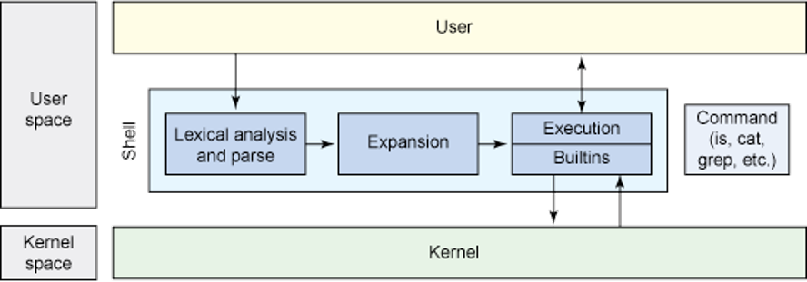

# Part 3: The shells
*chapter 8-9*

* [The Bourne Again Shell - bash (chapter 8)](https://www.gnu.org/software/bash/)
* [Bash programming (chapter 10)](https://tldp.org/LDP/abs/html/)
* [The TC shell (chapter 9)](https://www.tcsh.org/)


## Bash programming basics
A [shell](https://en.wikipedia.org/wiki/Shell_(computing)) is a computer program that exposes an operating system's services to a human user or other programs. Most of them try to be [Portable Operating System Interface(POSIX)](https://en.wikipedia.org/wiki/POSIX) compatible. [Unix shell](https://en.wikipedia.org/wiki/Unix_shell) has a long history.



* Windows 10/11 has [a subsystem for Linux](https://learn.microsoft.com/en-us/windows/wsl/install), which supports many Linux distributions (such as Ubuntu, OpenSUSE, Kali, Debian, Arch Linux, and more)


### Shell basics

```bash
# Find the shells on the system
ls -l /usr/bin/ | grep sh # are the output all shells

# Popular shells
# bash - the Bourne again shell
# sh - the original Bourne shell, links to bash or dash today
# dash - Debian Almquist shell, not bash-compatible, but faster
# both bash and dash try to be POSIX-compatible
ls -l $(which sh bash dash)

# What is the current shell
# Login shell - the first shell that displays a prompt when you 
# log in on a system from the system console or a virtual console remotely using ssh
# Interactive nonlogin shell - the shell opened from an emulator terminal in GUI
echo $0 # output -bash is login shell, while bash is interactive shell

# Run a new shell temporarily
zsh

## Find the nested shells
ps # show pids of all running shells
echo $$ # show pid of the current shell

# Find which shell you are using after login
cat /etc/passwd | grep "^$USER"

# Change your login shell
chsh full-path-to-new-shell
```

### symbolic commands

```bash
# help - Show all builtin commands
help 

# help command_name - find how to use builtin commands
help :

# symbolic commands
# ( command list ) - run command list in a subshell
(ls; exit 3;)
echo $?

# $( command list ) - command substitution
ls $(which bash)

# (( arithmetic )) - arithmetic evaluation
(( a=2, a++ ))
echo $a

# $(( arithmetic )) - arithmetic expansion, used as an integer calculator
echo $(( 3+2/4+5*2 + 5%2 ))

# [ condition ] - the test command is the left [, the right ] is its last argument
man [ 

[ -f myfile ] && echo myfile exist || echo myfile not exist

# [[ condition ]] - condition evaluation with string pattern match
help [[
[[ "good morning" =~ oo ]] && echo match

# \ - line continuation
echo this is a very long \
command line

# . or source command - Read  and execute commands (as well as scripts) 
# from filename in the current shell environment
. ~/.bashrc # make configuration effective immediately
```


### Shell scripts and variables
A shell script is a file that holds commands the shell can execute.

* Create a shell script and make it executable
```bash
# create a shell script with a text editor
vim myscript.sh

# put the following code inside
# --------------
#!/usr/bin/bash
# the #! above is called hashbang or shebang, 
# followed by the shell specified to execute this script
# comment: this shell script show users currently logged in
date # show current date and time
echo "Users currently logged in"
who
sleep 500
# --------------
# execute the script in a subshell
bash ./myscript.sh
# or make it executable
chmod +x myscript.sh
./myscript.sh # execute in subshell
ps

# exec - executes a Shell command without creating a new process. 
# Instead, it replaces the currently open Shell operation.
exec ./myscript.sh # don't run it

# & - the shell executes the command in the background in a subshell
./myscript.sh &
ps
```

* Three useful bash options
  * -e (errexit) option causes bash to exit when a simple command (e.g., not a control structure) fails
  * -u (nounset) option causes bash to display a message and exit when it tries to expand an unset variable
  * –x option in the !# line to turn on debugging during development

```bash
#!/usr/bin/bash -eux
```

* Variables
  * shell variables - are available only in the shell they are created in
  * environment variables - can be passed to subshells

```bash
# declare and initialize a variable
myvar='a big day' # There can be NO whitespace on either side of the equal sign (=)
greeting=hello
coursename="Introduction to Unix"

# show the values of variables
echo $greeting, today is $myvar to learn $coursename
echo "$greeting, today is $myvar to learn $coursename"
echo "$greeting", today is $myvar to learn $coursename
echo '$greeting', today is \$myvar to learn $coursename

# show reserved key variables such as environment variables
env

# several important keyword variables
echo $USER # you
echo $HOME # your home directory
echo ~ # your home directory
echo $PATH # list of folders containing programs the shell looks for

# let shell search programs in ~/bin
export PATH=$PATH:~/bin

# * or ? in variable might be expanded by the shell
classes=class*
echo $classes

touch class{1..3}
echo ${classes}

# unset - remove a variable
classes=
echo $classes

unset myvar
echo $myvar

# show all shell variables
set
# show specified shell variables
set | grep greeting
set | grep "greeting\|myvar"
```

* List and modify variable attributes
  * **-** add attributes; **+** remove attributes
  * –r : makes a variable readonly
  * -x : makes a variable an environment variable
  * -i : declares a variable to be of type integer
  * -a : declares a variable as an array
  * -f : declares a variable to be a function name

```bash
# list all shell variables
declare

# list all readonly variables
declare -r

# list all readonly integer variables
declare -ir

# specify attributes
declare var1=value1
declare -r var2=value2
var2=newvalue
declare -rx var3=value3
declare +r var3 # can we remove attribute r?
declare +x var3 # remove attribute x

readonly var4=value4

# Shell needs to restart to reset constants
exec bash 
# or
exec bash –login
echo $var4
```

* pass variables and parameters to a script
```bash
# pass variables to a shell
var1=value1 var2=value2 varn=valuen ./myscript.sh
# pass parameters to a shell
./myscript.sh param1 param2 paramn

# the code in myscript.sh
#----------------------
#!/usr/bin/bash
echo "the script name is $0"
echo "$# parameters passed to me:"
echo "var1=$var1 var2=$var2 varn=$varn"
echo "parameters passed to me:"
echo "param1=$1 param2=$2 paramn=$3 param10=${10}"
echo "all parameters passed to me: $@"
echo "all parameters passed to me: $*"
exit 10
#----------------------

# value returned from the previous script or command
echo $?
```


### Customize shell behaviors

* Adjust bash behaviors from command line

```bash
# find bash command line options
bash --help
```
* [Customize bash prompts](https://phoenixnap.com/kb/change-bash-prompt-linux)
  * PS1 – primary prompt. This is where you set special characters or important information.
  * PS2 - secondary prompt. This is usually set as a divider between the prompt display and the text entry. It is also used to display when a long command is broken into sections with the \ sign.
  * PS3 - prompt for the select command.
  * PS4 - prompt for running a shell script in debug mode
* popular bash prompt options
  * \a – A bell character
  * \d – Date (day/month/date)
  * \D{format} – Use this to call the system to respond with the current time
  * \e – Escape character
  * \h – Hostname (short)
  * \H – Full hostname (domain name)
  * \j – Number of jobs being managed by the shell
  * \l – The basename of the shells terminal device
  * \n – New line
  * \r – Carriage return
  * \s – The name of the shell
  * \t – Time (hour:minute:second)
  * \\@ – Time, 12-hour AM/PM
  * \A – Time, 24-hour, without seconds
  * \u – Current username
  * \v – BASH version
  * \V – Extra information about the BASH version
  * \w – Current working directory ($HOME is represented by ~)
  * \W – The basename of the working directory ($HOME is represented by ~)
  * \\! – Lists this command’s number in the history
  * \\# – This command’s command number
  * \\$ – Specifies whether the user is root (#) or otherwise ($)
  * \\\\– Backslash
  * \\[ – Start a sequence of non-displayed characters (useful if you want to add a command  * or instruction set to the prompt)
  * \\] – Close or end a sequence of non-displayed characters

```bash
oldps1=$PS1 # save old PS1
PS1="\w\n\$" # two line prompt
PS1=$oldps1 # restore old PS1
```

* save the new prompt
  * personal bash configuration files: ~/.bash_profile, ~/.profile, ~/.bashrc, ~/.bash_login, ~/.bash_logout
  * system wide configuration files: /etc/profile, /etc/profile.d/*

```bash
cp ~/.bashrc ~/.bashrc.bk
vim ~/.bashrc # find and change the suitable PS1
```

* Adjust character attributes (color, font, etc.) and cursor position
  * control through non-printing character sequences (instructions)
  * two complex terminal subsystems: [termcap](https://en.wikipedia.org/wiki/Termcap) and [terminfo](https://en.wikipedia.org/wiki/Terminfo)
  * Character color is controlled by sending the terminal emulator an **ANSI escape code** embedded in the stream of characters to be displayed
  * non-printing characters are enclosed with the \[ and \] sequences
  
*Escape Sequences Used to Set Text Colors*

| Sequence | Text Color | Sequence | Text Color |
| --- | --- | --- | --- |
| \033[0;30m | Black      | \033[1;30m | Dark gray    |
| \033[0;31m | Red        | \033[1;31m | Light red    |
| \033[0;32m | Green      | \033[1;32m | Light green  |
| \033[0;33m | Brown      | \033[1;33m | Yellow       |
| \033[0;34m | Blue       | \033[1;34m | Light blue   | 
| \033[0;35m | Purple     | \033[1;35m | Light purple | 
| \033[0;36m | Cyan       | \033[1;36m | Light cyan   | 
| \033[0;37m | Light gray | \033[1;37m | White        | 

```bash
oldps1=$PS1
# set all text color to red
PS1="\[\033[0;31m\]<\u@\h \W>\$ "
# set the prompt text color to red, then return to normal (attribute = 0), black text 
PS1="\[\033[0;31m\]<\u@\h \W>\$\[\033[0m\] "
PS1=$oldps1
```

*Escape Sequences Used to Set Background Color*

| Sequence | Background Color | Sequence | Background Color |
| --- | --- | --- | --- |
| \033[0;40m | Black      | \033[0;44m | Blue       | 
| \033[0;41m | Red        | \033[0;45m | Purple     | 
| \033[0;42m | Green      | \033[0;46m | Cyan       | 
| \033[0;43m | Brown      | \033[0;47m | Light gray | 

```bash
oldps1=$PS1
# set prompt text color to white, background color to blue
PS1="\[\033[0;37m\033[0;44m\]<\u@\h \W>\$\[\033[0m\] "
PS1=$oldps1
```

* Moving the cursor is used to provide a information at a different location on the screen each time the prompt is drawn

*Cursor Movement Escape Sequences*

| Escape Code |   Action |
| --- | --- |
| \033[l;cH |     Move the cursor to line l and column c |
| \033[nA   |     Move the cursor up n lines |
| \033[nB   |     Move the cursor down n lines |
| \033[nC   |     Move the cursor forward n characters |
| \033[nD   |     Move the cursor backward n characters |
| \033[2J   |     Clear the screen and move the cursor to the upper-left corner (line 0, column 0) |
| \033[K    |     Clear from the cursor position to the end of the current line |
| \033[s    |     Store the current cursor position |
| \033[u    |     Recall the stored cursor position |

```bash
# find the terminal size in text mode
WIDTH=$(tput cols) # tells you the number of columns
HEIGHT=$(tput lines) # tells you the number of rows

# construct a prompt that draws a red bar at the top of
# the screen containing a clock (rendered in yellow text) 
# each time the prompt is displayed
PS1="\[\033[s\033[0;0H\033[0;41m\033[K\033[1;33m\t\033[0m\033[u\] <\u@\h \W>\$ "
```

* PS2-4 can be set similarly

```bash
# PS2 - prompts for more input
oldps2=$PS2
echo $oldps2
echo hello \ # line continuation, type ENTER

# change PS2
PS2="continue ==>> "
ls | # type ENTER, some symbols work as lin continuation

# PS3 holds the menu prompt for the ‘select’ control structure  
oldps3=$PS3
echo $oldps3

# select your action, CTRL+d to quit
select a in [hvdcm]
do
  echo "Your action is $a"
done

PS3="Please select your action: "
# then run the above select block again, what did you see?

# PS4 - debugging prompt
oldps4=$PS4
echo $oldps4
PS4="expanded command> "
# run the script below
#----------------------
#!/bin/bash -x
select a in [hvdcm]
do
  echo "Your action is $a"
done
#----------------------
```

* CDPATH - The search path for the cd command.  This is a colon-separated list of directories in which the shell looks for destination directories specified by the cd command.
  * By default cd only searches the current working directory and its sub-directories
  * The default value of CDPATH is empty

```bash
mkdir -p /tmp/$USER/homework/assignment{1..10}
export CDPATH=$CDPATH:$HOME:/tmp/$USER/homework
cd
cd assignment2
pwd # What is your current directory?

```

* IFS - separates input fields (word splitting)
  * It has the default value of SPACE-TAB-NEWLINE

```bash
echo "one" > file1
echo two > file2
twofiles=file1:file2

cat $twofiles

oldifs=$IFS # save current IFS
IFS=":"
cat $twofiles
IFS=$oldifs # restore previous IFS
```


### [View and set system locales](https://www.tecmint.com/set-system-locales-in-linux/)
The locale specifies the way locale-aware programs display data such currency, date and time, telephone numbers, and measurements. The value of one or more locale variables has format: xx_YY.CHARSET

* xx - the [ISO-639 language code](https://en.wikipedia.org/wiki/List_of_ISO_639-1_codes)
* YY - the [ISO-3166 country code](https://en.wikipedia.org/wiki/List_of_ISO_3166_country_codes)
* CHARSET -  the name of the character set, also called the *character map or charmap*

```bash
# locale - display the current locales variables
# Unless explicitly set, each of the LC_ variables 
# derives its value from LANG
locale
locale -a # show all available locales
locale -m # show all available character maps 

# localectl - Query or change system locale and keyboard settings.
localectl status

# view more information about a locale variable
locale -k LC_TIME

#  some LC_ variables change displayed values
LC_TIME=en_GB.UTF-8 date +%x # format to Great Britain standard
LC_TIME=en_US.UTF-8 date +%x # format to US standard

# lookup locale variables
man locale

```

The [setlocale](https://man7.org/linux/man-pages/man3/setlocale.3.html) function is used to set or query the program's current locale. [Locale definition](https://gcc.gnu.org/onlinedocs/libstdc++/manual/localization.html) files are kept in the /usr/share/i18n/locales on Linux.

### [View and set time zone](https://linuxize.com/post/how-to-set-or-change-timezone-in-linux/)
* The time is usually set by the user when the system is first installed
* The [TZ variable](https://www.gnu.org/software/libc/manual/html_node/TZ-Variable.html) gives programs access to information about the [local time zone](https://community.intersystems.com/post/setting-tz-environment-variable-linux)


```bash
date # what is the local time zone?
TZ=EST+5EDT date # use a new time zone: zone_name timeoffset

# set TZ with continent/country
TZ=Australia/Victoria date

# tzselect - set the TZ variable
tzselect
```
* [date command in bash](https://linuxhint.com/date-command-bash/)

### File descriptor and redirection

* standard file descriptors
    * 0 - standard input
    * 1 - standard output
    * 2 - standard error


```bash
echo 1234567890 >myfile
# open myfile for read/write and assign fd 5 to it
exec 5<> myfile
# list open file descriptors
ls -la /proc/$$/fd

# or use lsof
lsof -p $$
# read only 4 chars
read -n 4 <&5
# write a decimal point there
echo -n . >&5
# close fd 5
exec 5>&-
cat myfile
```

* I/O redirection summary

| redirection | explanation |
| --- | --- |
| command > myfile | redirection stdout to myfile |
| command >> myfile | Redirect stdout to myfile, Creates myfile if not present, otherwise appends to it. |
| : > myfile | truncate myfile if exist or create it if not exist |
| > myfile | similar to : > myfile |
| >!myfile | similar to :>myfile even noclobber is set |
| 1>myfile | Redirect stdout to myfile |
| 1>>myfile | Redirect and append stdout to myfile |
| 2>myfile | Redirect stderr to myfile |
| 2>>myfile | Redirect and append stderr to myfile |
| &>myfile | Redirect both stdout and stderr to myfile |
| n>myfile | redirect fd n to myfile |
| m>&n | redirect fd m to fd n |
| 2>&1 | redirect stderr to stdout |
| \|& | shorthand for 2>&1 \| |
| >&n | redirect stdout to fd n |
| 0<myfile <br> <myfile | redirect stdin from myfile |
| [n] <> myfile | open myfile for read/write<br> if myfile does not exist, create it<br> if fd n is not specified, default to fd 0, stdin |
| command < infile >outfile | equivalent to < infile command >outfile |
| n<&- | close input fd n |
| 0<&- <br> <&- | close stdin |
| n>&- | close output fd n |
| 1>&- <br> >&- | close stdout |

**[note](https://hangar118.sdf.org/p/bash-scripting-guide/redirection_io.html)**

```bash
ls -yz >> command.log 2>&1
#  Capture result of illegal options "yz" in file "command.log."
#  Because stderr is redirected to the file,
#+ any error messages will also be there.

#  Note, however, that the following does *not* give the same result.
ls -yz 2>&1 >> command.log
#  Outputs an error message, but does not write to file.
#  More precisely, the command output (in this case, null)
#+ writes to the file, but the error message goes only to stdout.

#  If redirecting both stdout and stderr,
#+ the order of the commands makes a difference.

```

## References
* [Bash Shell Scripting](https://en.wikibooks.org/wiki/Bash_Shell_Scripting)
  * [Advanced Bash-Scripting Guide](https://tldp.org/LDP/abs/html/)
    * [on github](https://github.com/pmarinov/bash-scripting-guide)
    * [in HTML](https://hangar118.sdf.org/p/bash-scripting-guide/index.html)
* [The Linux Command Line](https://linuxcommand.org/)
* [Terminfo and Termcap](https://tldp.org/HOWTO/Text-Terminal-HOWTO-16.html)
* [How do file descriptors work?](https://stackoverflow.com/questions/7082001/how-do-file-descriptors-work)
  * [What's the range of file descriptors on 64-bit Linux?](https://stackoverflow.com/questions/8059616/whats-the-range-of-file-descriptors-on-64-bit-linux)
  * [List the Open File Descriptors in the Current Bash Session](https://www.baeldung.com/linux/list-open-file-descriptors)
  * [In Bash, what is file descriptor 255 for, can I use it?](https://unix.stackexchange.com/questions/475389/in-bash-what-is-file-descriptor-255-for-can-i-use-it)
* [date](https://ss64.com/bash/date.html)
  * [Bash Date Format Options](https://www.tutorialkart.com/bash-shell-scripting/bash-date-format-options-examples/)